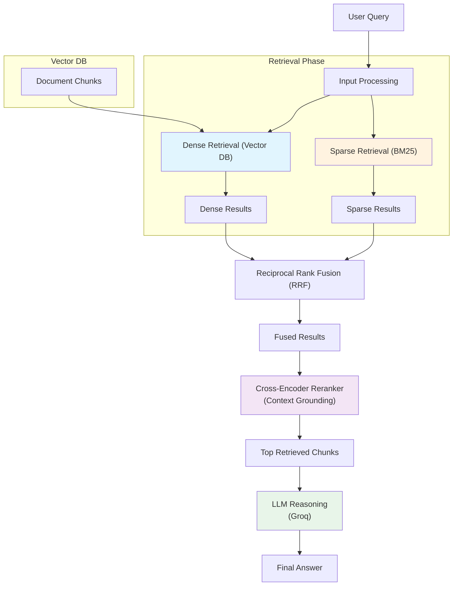

# HybridRAG: Retrieval-Augmented QA with Hybrid Search and Reranking

A Question-Answering system that combines **Dense Retrieval** (semantic search) and **Sparse Retrieval** (keyword search) using **Reciprocal Rank Fusion (RRF)**, and enhances accuracy with a **Cross-Encoder Reranker**.

## Live Demo
Check out the deployed application on Streamlit Community Cloud: 
**[Live Demo Link](https://hybridrag-retrieval-augmented-app-with-hybrid-search-reranking.streamlit.app/)**

## Features
- **Hybrid Search**: Combines BM25 (keyword) and Vector Search (semantic) for optimal recall and precision.
- **RRF Fusion**: Merges ranked lists from both retrieval methods to produce a unified ranked list.
- **Cross-Encoder Reranking**: Uses a transformer-based model to re-rank the top retrieved documents for maximum accuracy.
- **LLM Grounding**: Generates answers grounded in the retrieved context.
- **Evaluation**: Includes scripts to evaluate retrieval performance using MRR, Precision, and Recall.

## Prerequisites
- Python 3.8+
- API Key for Groq (https://groq.com/)

## Installation

1. Clone the repository:
```bash
git clone <repository-url>
cd HybridRAG-Retrieval-Augmented-QA-with-Hybrid-Search-Reranking
```

2. Setup virtual environment:
```bash
python -m venv venv
# On Windows:
.\venv\Scripts\activate
# On macOS/Linux:
source venv/bin/activate
```

3. Install dependencies:
```bash
pip install -r requirements.txt
```

4. Setup Environment Variables:
Create a `.env` file in the root directory and add your Groq API key:
```env
GROQ_API_KEY=your_groq_api_key_here
```

## Usage

### Run the Pipeline
The pipeline is split into two steps to prevent re-downloading data on every run.

1. **Ingest Data (Run Once)**
Fetches Wikipedia data, chunks it, and builds the vector and sparse indexes.
```bash
python ingest.py
```

2. **Run the Streamlit App (Run repeatedly)**
Loads the pre-built indexes and launches the interactive web interface.
```bash
streamlit run app.py
```

### Configuration
You can modify the default parameters in `src/config.py`:
- `CHUNK_SIZE`, `CHUNK_OVERLAP`: For splitting documents.
- `TOP_K_RETRIEVAL`: Number of documents to retrieve from each retriever.
- `RRF_K`: Constant for Reciprocal Rank Fusion.
- `RERANK_MODEL`: The cross-encoder model to use.
- `EMBEDDING_MODEL`, `BM25_TOP_K`: Settings for retrieval.
- `LLM_MODEL`: The Groq LLM to use.
- `METADATA_RETRIEVAL`: Whether to use metadata during reranking (experimental).

### Evaluation
To evaluate the retrieval performance:
1. Prepare `qrels.json` (ground truth) and `run.json` (retrieved results).
   Example structure:
   ```json
   // qrels.json
   {
     "query_1": ["doc_id_1", "doc_id_3"],
     "query_2": ["doc_id_2"]
   }

   // run.json
   {
     "query_1": ["doc_id_3", "doc_id_1", "doc_id_2"],
     "query_2": ["doc_id_2", "doc_id_5", "doc_id_1"]
   }
   ```

2. Run the evaluation script:
   ```bash
   python eval/evaluate.py --qrels qrels.json --run run.json --k 10
   ```

## Architecture



## Testing

Run unit tests to verify individual components:
```bash
pytest tests/test_retriever.py
pytest tests/test_fusion.py
pytest tests/test_reranker.py
```

## Notes

- The system uses Wikipedia for initial data collection. For production, consider using a more stable and curated dataset.
- The Cross-Encoder Reranker uses `sentence-transformers`. Ensure the model is downloaded on first run.
- **Warning:** On Windows, keep your project folder path short (e.g., `HybridRAG`) to avoid pip installation errors caused by the 260-character path limit.

